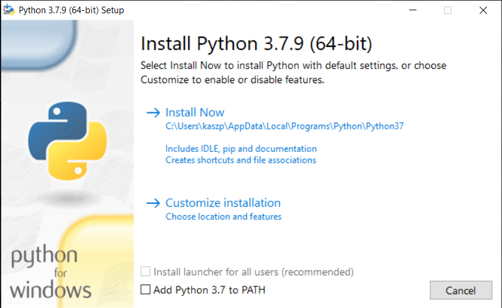
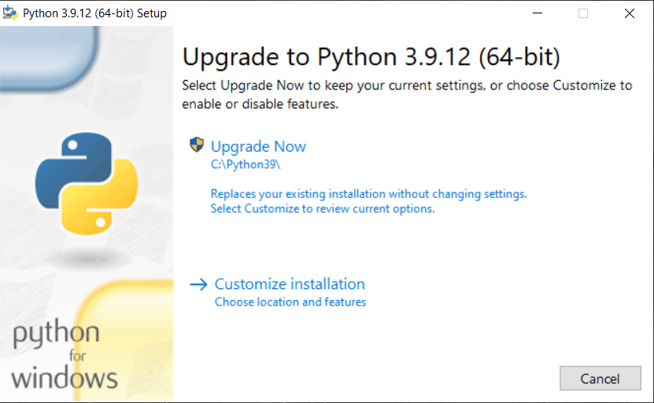
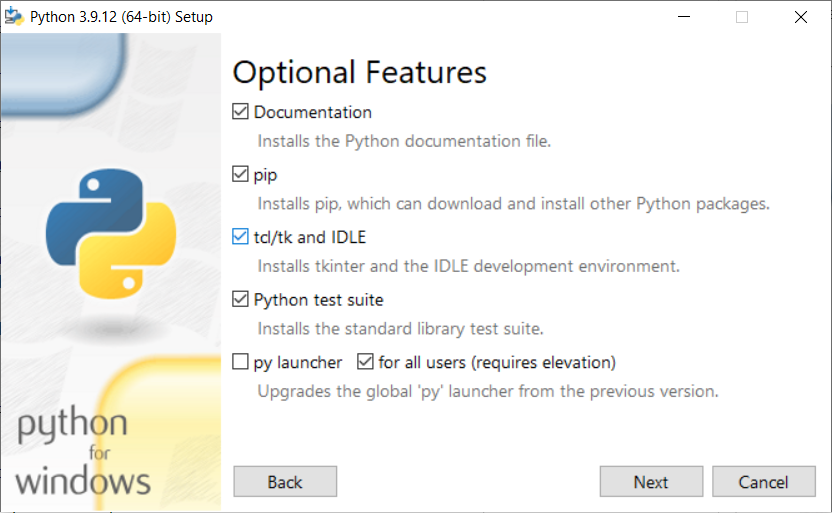
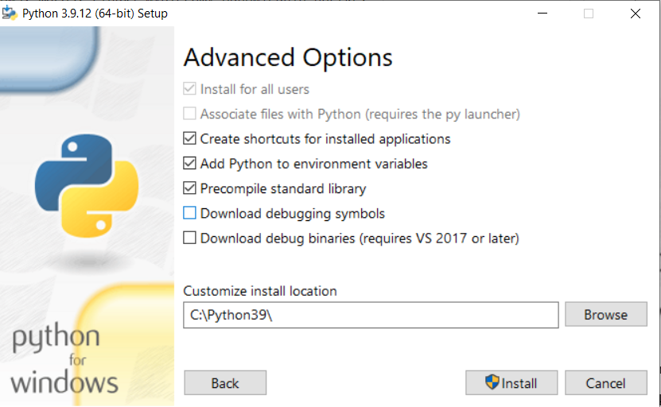
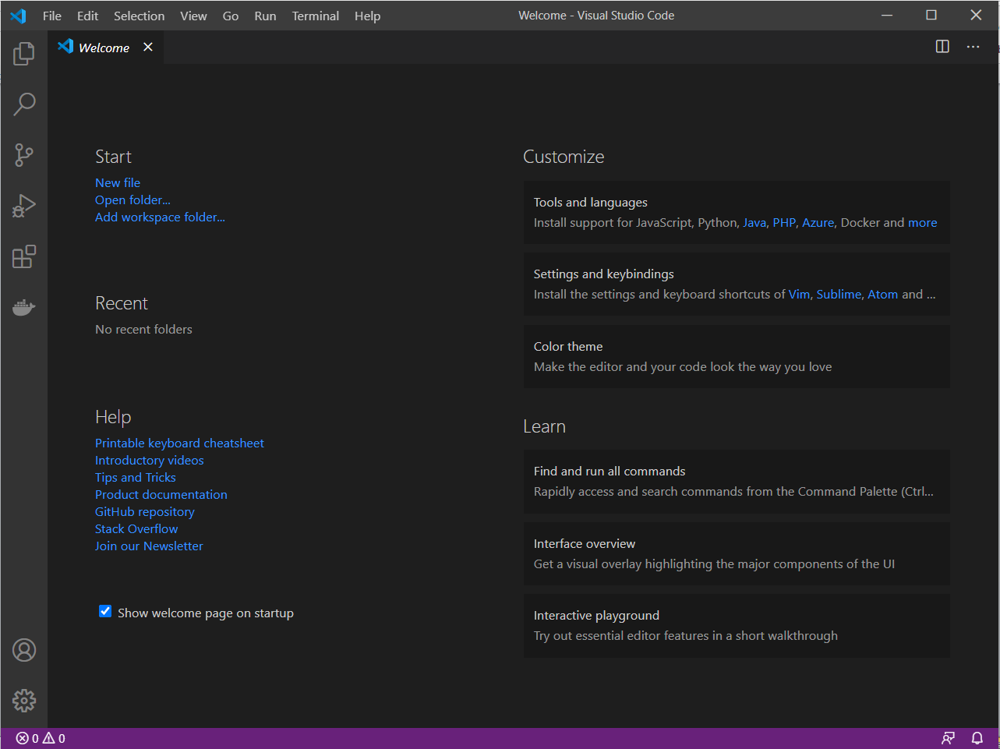
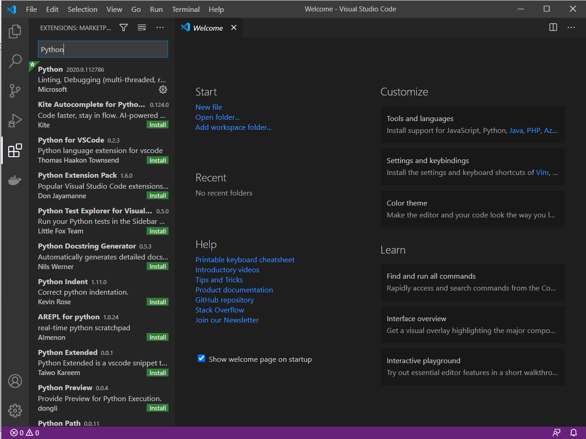

# Wprowadzenie do języka Python

## Lab 00. Przygotowanie środowiska pracy.

W trakcie zajęć jako środowisko IDE będzie wykorzystywane oprogramowanie Visual Studio Code. Jest to darmowe oprogramowanie firmy Microsoft, które w krótkim czasie zdobyło bardzo wielu użytkowników dzięki możliwości instalacji wielu dodatków, które pozwalają dostosować narzędzie do konkretnego projektu. Mimo, że natywnie VSC wspiera takie języki jak C++ i C# (platforma .NET) to dzięki plug-inom można dodać wsparcie kolejnych języków, a wtyczka pozwalająca na wsparcie języka Python jest jedną z najbardziej popularnych.

**Krok 1** – Instalacja oprogramowania Jetbrains PyCharm Community Edition ze strony https://www.jetbrains.com/pycharm/. Wybieramy wersję odpowiednią dla naszego systemu operacyjnego. Sama instalacja jest dość prosta i na nasze potrzeby nie będzie wymagała zmiany domyślnych ustawień.

**Krok 2** – Instalacja interpretera języka Python. 
Na stronie https://www.python.org/ przechodzimy do podstrony Downloads i odnajdujemy wersję 3.9.12. (https://www.python.org/downloads/release/python-3912/). Warto tutaj zaznaczyć, że wersja 3.9.+ nie będzie działała z systemami z rodziny Windows 7 lu starszymi. Następnie w części **Files** (na dole strony) odnajdujemy paczkę dla naszego systemu operacyjnego. Jeżeli nie jesteśmy pewni czy dysponujemy wersją 32 czy 64-bitową systemu operacyjnego, można to sprawdzić wybierając z menu kontekstowego (prawy przycisk myszy) na ikonie Ten komputer (lub Mój komputer) w przypadku systemu Windows. Dla wersji 64-bit właściwą paczką dla systemu Windows będzie Windows x86-64 executable installer, a dla 32-bitowej Windows x86 executable installer.
Uruchomienie pobranego pliku skutkuje pojawieniem się okna podobnego do poniższego (akurat dla wersji 3.7.x).

 
Jeżeli dana wersja interpretera Pythona jest już zainstalowana pojawi się okno podobne do poniższego. Tutaj będziemy mieli możliwość zmiany parametrów już zainstalowanego środowiska.

Jeżeli jest to jedyny interpreter języka Python w naszym systemie możemy dodać interpreter do ścieżki systemowej (zmienna środowiskowa **PATH**). Spowoduje to możliwość korzystania z interpretera nie tylko bezpośrednio z folderu, do którego został zainstalowany. Zaznaczamy więc checkbox _**„Add Python 3.8 to PATH”**_. 

Jeżeli chcemy zainstalować interpreter w domyślnej zaproponowanej lokalizacji wybieramy opcję **„Install Now”**. Jeżeli chcemy wybrać inną ścieżkę i zobaczyć dodatkowe opcje wybieramy **„Customize installation”**. Poniżej podgląd okna z wyborem opcji do zainstalowania.

Wybranie **„Next”** wyświetli poniższe okno, gdzie możemy wybrać inną ścieżkę instalacji.

Dla naszych potrzeb wystarczą opcje domyśnle, można jedynie wskazać inną ścieżkę instalacji.

**Krok 3 (Opcjonalnie)** Instalacja środowiska Visual Studio Code.

Pobieramy i instalujemy Visual Studio Code ze strony https://code.visualstudio.com/ . W zależności od platformy (Windows, macOS, Linux) wybieramy odpowiednią paczkę.

Uruchamiamy Visual Studio Code (przykładowe okno poniżej) i wybieramy po lewej stronie ikonę _**Extensions**_. 

 
 
Wyszukujemy frazę „Python” i na odpowiednim elemencie z listy wybieramy _**Install**_ (na screenie poniżej plug-in jest już zainstalowany).
 

To już prawie wszystko aby móc pracować z językiem Python z wykorzystaniem Visual Studio Code. Szczegóły i dodatkowe możliwości narzędzia zostaną zaprezentowane podczas zajęć.
